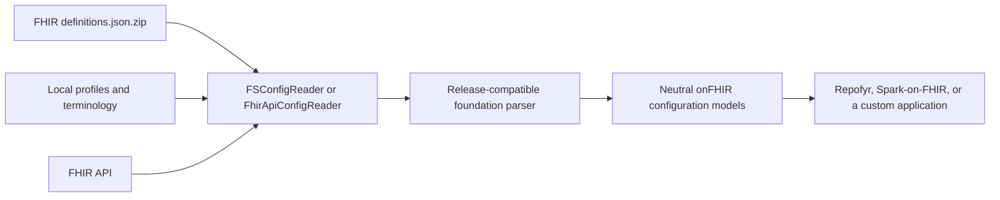

# onfhir-config

`onfhir-config` builds runtime configuration for FHIR applications from FHIR
infrastructure resources. It combines an official FHIR JSON definitions ZIP
with application-specific configuration resources, rather than requiring the
application to embed a fixed copy of a FHIR release in its build.

This enables release-independent application configuration: a deployment can
select the exact FHIR definition package it needs, including a compatible
minor-release `definitions.json.zip`. Repofyr uses the module to configure its
FHIR server capabilities, and Spark-on-FHIR uses the same approach to process
FHIR data without hard-coding a single release's definitions.

Maven coordinate: `io.onfhir:onfhir-config_2.13`.

## How it works



The module provides readers for configuration resources and reusable logic for
turning them into compact onFHIR configuration models. A release-compatible
implementation of `IFhirFoundationResourceParser` interprets the resource
content; for example, `onfhir-r4` provides `R4Parser` and `onfhir-r5`
provides `R5Parser`.

## Supported resources

| FHIR resource | Configuration it contributes |
| --- | --- |
| `CapabilityStatement` | Supported resources, interactions, searches, and operations |
| `StructureDefinition` | Resource types, profiles, extensions, and validation constraints |
| `SearchParameter` | Search parameter paths, types, modifiers, and targets |
| `ValueSet` and `CodeSystem` | Terminology restrictions |
| `OperationDefinition` | Operation metadata and parameters |
| `CompartmentDefinition` | Compartment membership relationships |

## Sources

`FSConfigReader` reads an official FHIR `definitions.json.zip` and
application-specific resources from local files, folders, or ZIP files.
`FhirApiConfigReader` reads configuration resources and the server
`CapabilityStatement` from a FHIR API. Both implement `IFhirConfigReader`, so
applications can provide their own source when needed.

```scala
import io.onfhir.config.FSConfigReader

val reader = new FSConfigReader(
  // Use the official package for the exact release required by this deployment.
  fhirVersion = "4.0.1",
  fhirStandardZipFilePath = Some("definitions.json.zip"),
  profilesPath = Some("profiles"),
  valueSetsPath = Some("terminology/value-sets"),
  codeSystemsPath = Some("terminology/code-systems"),
  searchParametersPath = Some("search-parameters")
)

val capabilityStatement = reader.readCapabilityStatement()
val profiles = reader.getInfrastructureResources("StructureDefinition")
```

## Building a base configuration

`BaseFhirConfigurator` loads the base standard definitions, validates supplied
profiles and terminology resources, and produces a `BaseFhirConfig`. The
application supplies the parser appropriate to its selected FHIR release.

```scala
import io.onfhir.api.parsers.IFhirFoundationResourceParser
import io.onfhir.config.{BaseFhirConfigurator, FhirCapabilityDefaults, FSConfigReader}
import io.onfhir.r4.parsers.R4Parser

val reader = new FSConfigReader(
  fhirVersion = "4.0.1",
  fhirStandardZipFilePath = Some("definitions.json.zip")
)

val configurator = new BaseFhirConfigurator {
  override val fhirVersion: String = "R4"

  override def getFoundationResourceParser(
      complexTypes: Set[String],
      primitiveTypes: Set[String],
      capabilityDefaults: FhirCapabilityDefaults
  ): IFhirFoundationResourceParser =
    new R4Parser(complexTypes, primitiveTypes, capabilityDefaults)
}

val fhirConfig = configurator.initializePlatform(reader)
```

`SearchParameterConfigurator` supplements this base configuration by deriving
search metadata from `SearchParameter` expressions or XPath paths. It builds
on `BaseFhirProfileHandler` (package `io.onfhir.validation`, owned by this
module), a reusable helper that navigates parsed profile restrictions to
resolve an element path to its definition, target data type, and array
cardinality, including choice (`[x]`) elements, paths continuing inside
complex data types, and `contentReference` redirection.

## Release-independence boundary

Release-independent configuration does not mean one parser automatically
understands every FHIR release. It means that the standard definition package
and application-specific canonical resources are data selected at deployment
time rather than definitions hard-coded into an application build. Each FHIR
release family still requires a compatible foundation-resource parser and
application behavior where its resource semantics differ.

For a minor release, supply that release's official JSON definition ZIP and
use a parser compatible with its resource shape. This keeps configuration data
separate from application releases while making the compatibility boundary
explicit.

## Scope

Principal APIs are `FSConfigReader`, `FhirApiConfigReader`,
`BaseConfigReader`, `BaseFhirConfigurator`, `SearchParameterConfigurator`,
and `BaseFhirProfileHandler`.

This module reads and interprets FHIR infrastructure resources. It does not
start a FHIR server, configure persistence, own global runtime configuration,
or download definition packages automatically. Those responsibilities belong
to the consuming application.
